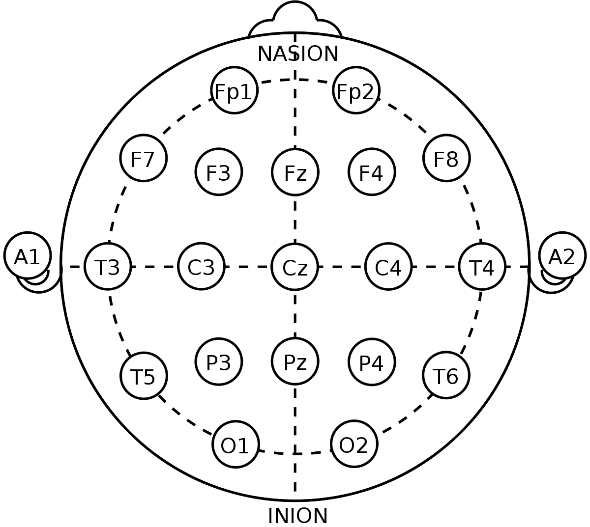
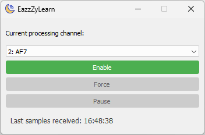
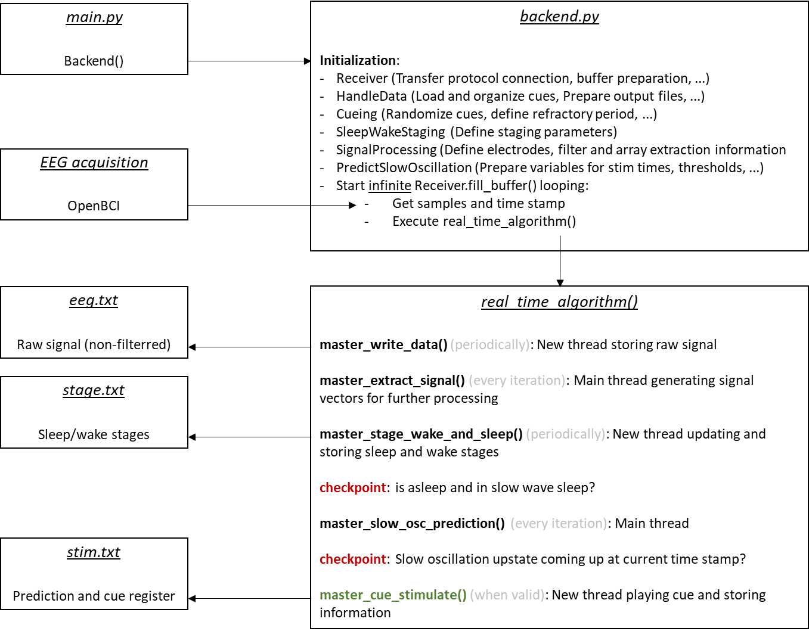

# EazzZyLearn
V2025.06

## Overview  
EazzZyLearn is a real-time closed-loop neurofeedback system for sleep research that detects deep sleep and triggers memory reactivation cues. The system processes EEG data in real-time to detect slow oscillations during sleep and automatically plays audio cues to enhance memory consolidation using **Targeted Memory Reactivation (TMR)** techniques.

The system features dual sleep classification methods:
- **Traditional spectral analysis** with research-validated thresholds (85.88% accuracy)
- **Advanced machine learning classification** using pre-trained sleep staging models

All parameters for online analysis and stimulation are configured in **`PythonVersion/parameters.py`**.

## Compatibility
- Interaxon Inc. Muse 2, Muse S 2nd Gen and Muse S Athena
- OpenBCI Cyton

## Installation and Dependencies
Install required dependencies using:
```bash
pip install -r requirements.txt
```

Key dependencies include: spectrum, sounddevice, scipy, matplotlib, numpy, python-osc for OSC communication with Muse devices.

## Execution Modes
EazzZyLearn offers three execution modes for different research phases:

| Mode | Script | Purpose |
| :---- | :---- | :---- |
| Sleep Study | `python PythonVersion/main_SLEEP.py` | Real-time sleep monitoring and cue delivery during slow wave sleep |
| Study/Encoding | `python PythonVersion/main_STUDY.py` | Cognitive task accompaniment with background sounds and periodic cues for memory encoding |
| Developer Mode | `python PythonVersion/main_DEVELOPERMODE.py` | Development and testing with simulated EEG data |

### Targeted Memory Reactivation Workflow
1. **Encoding Phase** (`main_STUDY.py`): Present background sounds with periodic cue sounds during cognitive tasks to create memory-cue associations
2. **Sleep Phase** (`main_SLEEP.py`): Detect slow wave sleep and replay the same cues to boost memory reactivation and consolidation

## Manual parameters (changing for every session)
### Recording session information
Subject- and session-specific information

| Parameter | Explanation |
| :---- | :---- |
| OUTPUT\_DIR | Folder where all data outputs (stimulation information, EEG signals, …) will be stored |
| SUBJECT\_INFO | Important identifying information about the subject. Dictionary containing participant information: name, age, sex, chosen cue sound, background sound, and cue interval. Sample rate is constant = **256 Hz** (Muse headband standard) |
| CORRECT\_ANSWERS | Answers that were correct in the memory task game. Comment out (by placing a **“\#”** in front of the line) the answers that were **NOT** correct |
| FORCE\_CUE\_LISTS | In case the stimulation code is restarted, you can predefine the list of stimulated cards with this parameter. Look at the output file header of when the code was run first time to see which cards had been chosen for stimulation |

### Channel information

If necessary, you have to change the channel list based on where you placed scalp electrodes and where you plugged them in to OpenBCI \[1\]. Numbers in the list represent the pins occupied on the OpenBCI board. Keep in mind that **Python indices are starting with 0**. Therefore, 0 \= 1, 1 \= 2, … on the OpenBCI board\!

| Parameter  | Explanation |
| :---- | :---- |
| NUM\_CHANNELS  | Information of the data structure coming from OpenBCI. This indicates the total number of channels available on the board, NOT the number of channels used (pins occupied)\! |
| elec | Python dictionary where \[“XXX”\] XXX is the name of the channel and the number \= xxx the index of the channel on the board (careful with Python indexing starting at 0\!) |
| IDX\_ELEC | The index of the channel that will be used by default. Slow oscillations are best detected in the frontal area \[2\]. The index has to be set by **defining the dictionary entry** Dictionary\[“Key”\] (ie elec\["Fp2"\]) |

*\[1\] Illustration of the OpenBCI Cython board and pin organization*


*\[2\] Illustration of the 10-20 scalp EEG system*



## Constant parameters (should not change)
### Data Import (OSC Streaming)
| Parameter | Explanation |
| :---- | :---- |
| IP | IP address for OSC data reception: EEG data from Muse headbands is received via OSC protocol. Set to '0.0.0.0' to listen on all interfaces |
| PORT | OSC port for EEG data reception (default: 12345). Must match the port configured in Muse-Lab or streaming application |
| MAIN\_BUFFER\_LENGTH | Buffer length in milliseconds (ms) of the imported data. The longer the buffer, the **more accurate** the code **but the slower** the code as well. |
| DELTA\_BUFFER\_LENGTH | Length (ms) of the time window that will be used to extract slow oscillations. Arbitrary length, but has to be long enough to contain at least one slow oscillation (up to 2000 ms per slow oscillation) |
| THRESHOLD\_BUFFER\_LENGTH | Length (ms) of the time window that will be used to determine the minimum downstate amplitude for a slow oscillation to have in order to be considered valid for stimulation. \[**3 for explanation**\] |
| SLEEP\_BUFFER\_LENGTH | The vector length (ms) of the signal used for sleep staging. **30s time windows** are standard in sleep research. |
| REPONSE\_BUFFER\_LENGTH | Length (ms) of time window used for detecting awakening of the subject. The shorter the window the faster we detect wakening but the more the signal fluctuations (inaccuracy) |

\[3\] After every stimulation, we have to expect that the brain gets less synchronized because of the sound “perturbation” (amplitudes of slow oscillation downstates and upstates decreasing) and might even shift to lighter sleep stages. Here we assure that we only consider downstates of slow oscillations that are at least as synchronized as the ones inside the time window (length defined by threshold vector length) before. The longer the more aggressive the threshold is and the less we will stimulate. The shorter the more we stimulate, but the more we risk for subjects to slowly wake up.

### Cue-related
| Parameter | Explanation |
| :---- | :---- |
| LEN\_REFRACTORY | Number (seconds) which defines how long after a cue stimulation, we “leave the brain in peace” without triggering any subsequent stimulation even if there is a slow oscillation (indication from Schreiner et al., 2015, Nature Communications that cue+feedback destroys CMR effects) |
| DEFAULT\_THRESHOLD | Default negative amplitude (microvolts) under which a slow oscillation throw is considered valid |
| NON\_PHYSIOLOGICAL\_THRESHOLD | This inversibly of the DEFAULT\_THRESHOLD invalidates negative amplitudes that are too low as large fluctuations from muscle movements could be interpreted as slow oscillation throws |
| SLEEP\_STAGE\_INTERVAL | How often (seconds) the code is evaluating the sleep stage of the subject (differentiates between Slow Wave Sleep (SWS) and any “other” stage) |
| WAKE\_STAGE\_INTERVAL | How often (seconds) the code is evaluating the wake stage of the subject (differentiates between is or is not awake) |
| SLEEP\_THRESHOLDS | Values (unitless or PSD values) that help wake and sleep staging processes to distinguish between stages. Values are based on observations |
| WAKE\_THRESHOLDS | Same as SLEEP\_THRESHOLDS but for wake staging. |
| FREQUENCY\_BANDS | Frequency limits for general filtering purposes and power estimations of frequency bands |
| FILT\_ORDER | Order to the butter window used for filtfilt method |
| USE\_MUSE\_SLEEP\_CLASSIFIER | Boolean flag to enable advanced ML-based sleep classification (True) or use traditional spectral analysis (False) |

### General data handling
| Parameter | Explanation |
| :---- | :---- |
| DATA\_SAVE\_INTERVAL | How often the EEG data gets written to disk |
| ENCODING | Specifying data output format for easier import later |

## Data output formats
All data outputs are stored in plain text files .txt. All files contain the same header information about the subject/recording/parameters used. Data is stored in a comma separated manner in columns where the first is always the time stamp of the occurrence of the data in milliseconds.

Three different outputs are generated:

1. “\[...\]**\_eeg**.txt”: contains the raw signal from all channels (even non-used ones) where columns are channels and rows are signal samples at different time stamps  
2. “\[...\]**\_stages**.txt”: contains all information about the current wake and sleep stage evaluations of the subject  
3. “\[...\]**\_pred**.txt”: contains time stamps of detected downstates and predicted upstates  
4. “\[...\]**\_stim**.txt”: Contains several information:  
   - Stimulations and which cue has been presented  
   - Softstate of the code (that is, we can manually block/force stimulations)  
   - Switches between electrode channels for slow oscillation prediction and stimulation  
   - Lastly, all predicted slow oscillation upstates  

An anticipated **ending/quitting of the code will not lead to any data loss if executed correctly** (specified in section “Interaction with code”).

## Compilation
The main_[...].py scripts are compilable via Nuitka:
`python3.12 -m nuitka --standalone --follow-imports --include-package=PyQt5 --enable-plugin=pyqt5 --include-data-dir=PythonVersion/frontend/assets=frontend/assets --include-data-dir=Sounds=Sounds --output-dir=build --output-filename=EazzZyLearn.exe --windows-icon-from-ico=EazzZyLearn.ico ./PythonVersion/main_SLEEP.py`

Note that there is no `--onefile` comílation flag, as this is changing the way paths are handled and leads to assets not being found.


## Code Execution and Interaction
Execute the desired mode script (e.g., `python PythonVersion/main_SLEEP.py`) and the system will run until stopped manually. During execution, real-time control is available through a GUI control window:



### GUI Control Elements:
- **Channel Selection Dropdown**: Select the active processing channel (e.g., "2: AF7") for slow oscillation detection and stimulation
- **Enable Button** (Green): Normal operation mode - stimulation occurs automatically when slow oscillations are detected and sleep conditions are met
- **Force Button** (Gray): Ignore sleep/wake staging evaluations and force stimulation of any detected slow oscillations
- **Pause Button** (Gray): Pause stimulation of detected slow oscillations while continuing data recording and sleep staging
- **Status Display**: Shows "Last samples received" timestamp to monitor real-time data flow

### Safe Program Termination:
Close the GUI window to safely quit the program. The system will properly save all data and close connections before terminating.

## Fundamental structure of the code
General working scheme of the code shown below:



**Previous keyboard-based interaction has been replaced with GUI controls**\! You are requested to answer with “Y” in order to quit the program definitely or any other answer if you accidently hit Q and want to continue recording.

## System Architecture

### Code Organization
The system is organized in a modular structure with separate backend and frontend components:

```
PythonVersion/
├── backend/           # Core processing modules
│   ├── backend.py     # Master controller and real-time algorithm
│   ├── receiver.py    # OSC data reception and buffering
│   ├── signal_processing.py    # EEG filtering and frequency analysis
│   ├── sleep_wake_state.py     # Dual-mode sleep classification
│   ├── predict_slow_oscillation.py  # Slow oscillation detection and timing
│   ├── cueing.py      # Audio cue management and delivery
│   ├── handle_data.py # File I/O and session management
│   └── disk_io.py     # Data persistence utilities
├── frontend/          # User interface components
│   └── frontend.py    # Real-time GUI and keyboard controls
├── main_SLEEP.py      # Sleep study execution mode
├── main_STUDY.py      # Encoding phase execution mode
├── main_DEVELOPERMODE.py  # Development and testing mode
└── parameters.py      # Configuration parameters
```

### Main Program Entry Point (`main_SLEEP.py`)

```python
from backend.backend import Backend
from frontend.frontend import Frontend
from PyQt5.QtWidgets import QApplication
import sys

def main():
    app = QApplication(sys.argv)
    processing_controller = Frontend()
    backend = Backend(processing_controller)  # Initializes all subsystems and starts receiver
    processing_controller.show()
    app.exec_()
```

### Real Implementation - Core Classes and Methods

#### 1. **Backend** (`backend/backend.py`) - Master Controller
*Inherits from Receiver, orchestrates all real-time processing*

**Initialization:**
```python
class Backend(Receiver):
    def __init__(self, gui):
        super().__init__()
        self.HndlDt = HandleData('Sleep')
        self.Cng    = Cueing()
        self.Stg    = SleepWakeState()
        self.SgPrc  = SignalProcessing()
        self.Pdct   = PredictSlowOscillation()
        self.gui    = gui
        self.start_receiver(self.HndlDt.output_dir, self.HndlDt.subject_info)
```

**Key Method:**
- `real_time_algorithm(buffer, timestamps)` - Core processing pipeline:
  1. Update GUI status with current timestamp
  2. Save raw EEG data via HandleData
  3. Extract frequency bands via SignalProcessing
  4. Perform sleep/wake staging via SleepWakeState
  5. Check GUI control states (pause/force/channel switching)
  6. Predict slow oscillation timing via PredictSlowOscillation
  7. Trigger threaded audio cues via Cueing when conditions are met

#### 2. **Frontend** (`frontend/frontend.py`) - PyQt5 GUI Control
*Real-time control interface with live status updates*

**Key Methods:**
- `__init__()` - Create control window with channel dropdown, buttons, status label
- `start_stimulation()` / `force_stimulation()` / `pause_stimulation()` - Control stimulation states
- `channel_changed(value)` - Handle EEG channel switching (channels 1-6)
- `update_status_text(text)` - Real-time status updates from backend
- `closeEvent(event)` - Confirmation dialog for safe program termination

#### 3. **Receiver** (`backend/receiver.py`) - OSC Data Streaming
*Handles real-time EEG data reception from Muse headbands*

**Key Methods:**
- `prep_osc_receiver(ip, port)` - Setup OSC server listening on specified IP/port
- `handle_eeg_message(address, *args)` - Process /eeg messages (4 channels: TP9, AF7, AF8, TP10)
- `handle_muse_metrics_message(address, *args)` - Process /muse_metrics for ML sleep classification
- `fill_buffer()` - Main data loop that calls real_time_algorithm() for each sample
- `define_stimulation_state(key, outputfile, timestamp)` - Handle GUI control state changes

#### 4. **SignalProcessing** (`backend/signal_processing.py`) - Real-time Filtering
*Causal filtering and frequency band extraction for live processing*

**Key Methods:**
- `filt_signal_online(signal, b, a)` - Causal Butterworth filtering (order 3)
- `master_extract_signal(buffer)` - Extract multiple frequency bands:
  - Wake detection signal (0.1-45 Hz with notch filter)
  - Sleep analysis signal (delta-focused)
  - Delta band (0.5-4 Hz) for slow oscillation detection
  - Slow-delta band (0.5-2 Hz) for enhanced SO detection
- `switch_channel(number_pressed, outputfile, timestamp)` - Runtime channel switching

#### 5. **SleepWakeState** (`backend/sleep_wake_state.py`) - Sleep Classification
*Dual-mode sleep staging with traditional and ML approaches*

**Key Methods:**
- `staging(v_wake, staging_what, freq_range, output_file, time_stamp)` - Core classification:
  - Traditional: Welch PSD analysis with frequency band ratios
  - Muse ML: Pre-trained models with 6-second windows, TP10 channel optimization
- `band_ratio_thresholding(power, freqs, bands, threshold_val)` - Research-validated thresholds
- `power_spectr_welch()` - Power spectral density for traditional classification

#### 6. **PredictSlowOscillation** (`backend/predict_slow_oscillation.py`) - Timing Prediction
*Real-time slow oscillation detection and upstate timing prediction*

**Key Methods:**
- `extract_slow_oscillation_onset(delta_array, slow_delta_array)` - Zero-crossing downstate detection
- `downstate_validation(SO_onset_array, threshold)` - Amplitude and physiological validation
- `multiply_throw_time(onset_SO, sampling_rate, down_time)` - Sine wave model prediction (3x downstate duration)
- `master_slow_osc_prediction(...)` - Complete pipeline with adaptive thresholding

#### 7. **Cueing** (`backend/cueing.py`) - Audio Stimulation
*Low-latency audio cue delivery with refractory period management*

**Key Methods:**
- `cue_play(cue_array, sample_rate)` - Immediate audio playback using sounddevice
- `master_cue_stimulate(...)` - Threaded stimulation with timing precision and event logging
- Refractory period enforcement (6 seconds default) to prevent over-stimulation

#### 8. **HandleData** (`backend/handle_data.py`) - Session Management
*File I/O, cue preparation, and comprehensive session logging*

**Key Methods:**
- `prep_files(...)` - Create output files with detailed headers containing all session parameters
- `master_write_data(eeg_data, time_stamps, output_file)` - Buffered periodic data writing
- `prep_cue_load(cue_dir, cue)` - Pre-load audio cues as numpy arrays for zero-latency playback
